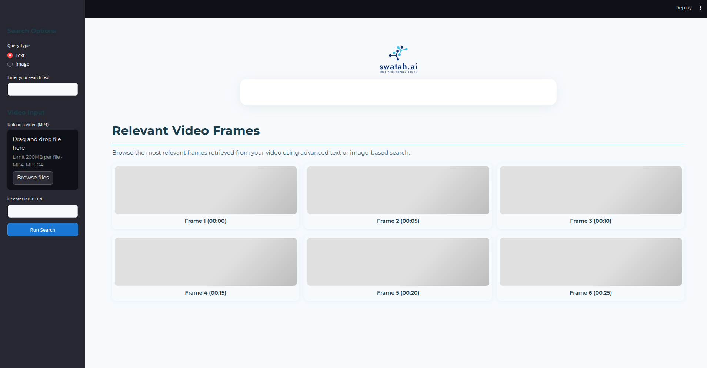

# Video Content Search Application

This project implements a **video content search application** that allows users to upload videos, process them to extract relevant information, and then search for content within the videos using natural language queries.

## Overview

The application is built with a modular architecture, comprising the following main components:

- **Server and Extractor** (`Server and Extractor/`):  
  Handles video ingestion, processing (e.g., frame extraction), and provides an API for interacting with the processed data.

- **Embedder** (`Embedder/`):  
  Responsible for generating vector embeddings of video frames using a machine learning model and storing them in a vector database (Milvus).

- **User Interface (UI)** (`UI/`):  
  A Streamlit-based web application that allows users to upload videos, view processing status, and perform semantic searches on the video content.

The system leverages **Docker** for containerization, making it easy to set up and run all the components.
