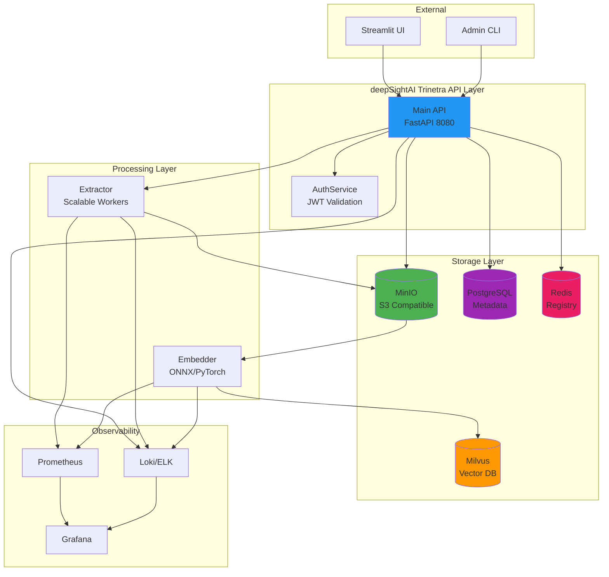
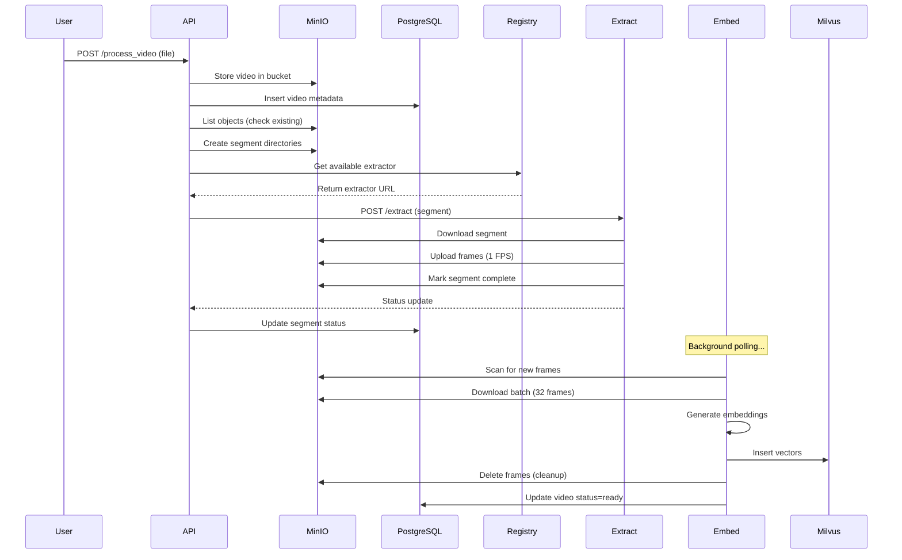
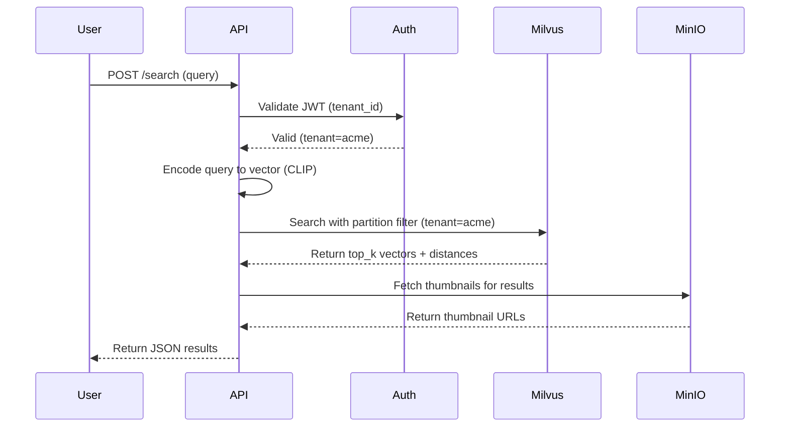
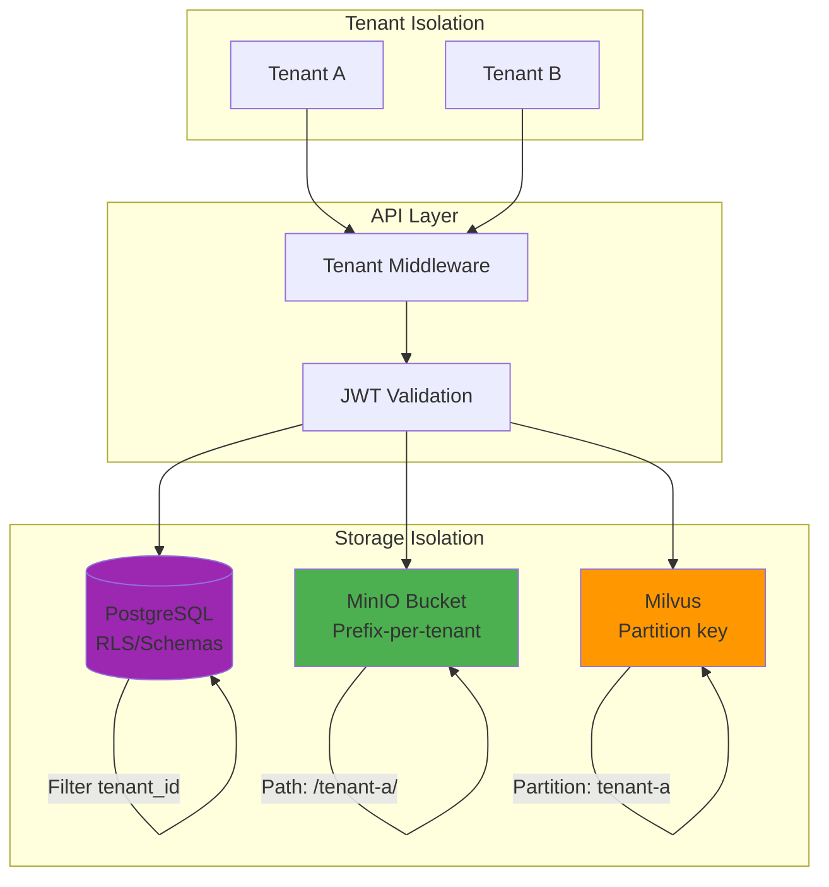
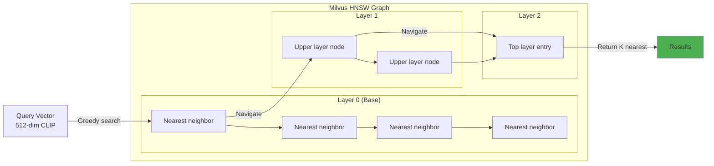
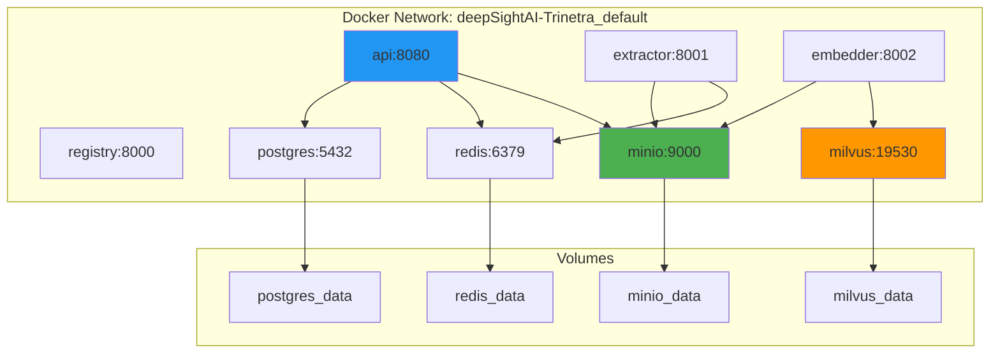
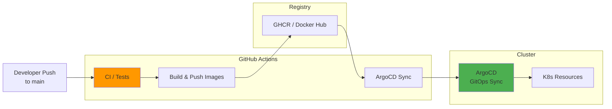
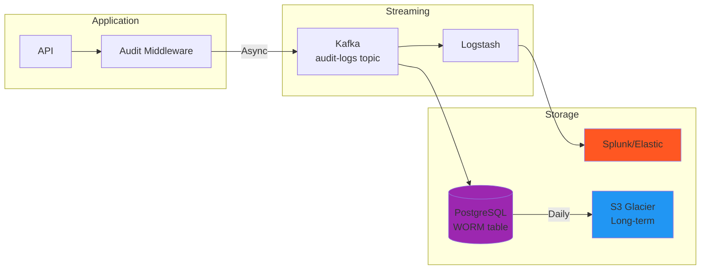
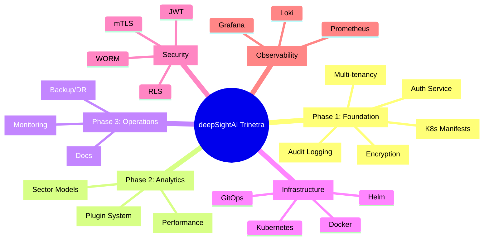

# Architecture Diagrams

This page provides visual representations of deepSightAI Trinetra architecture for quick understanding.

---

## High-Level System Overview



---

## Data Flow: Video Upload & Processing



---

## Data Flow: Search Query



---

## Kubernetes Deployment

```mermaid
graph TB
    subgraph "K8s Cluster: deepSightAI-Trinetra"
        subgraph "Namespace: deepSightAI-Trinetra"
            API[API Deployment<br/>Replicas: 3]
            Extract[Extractor<br/>Replicas: 10-50 (HPA)]
            Embed[Embedder<br/>Replicas: 1-5 (GPU)]
            PG[PostgreSQL<br/>StatefulSet]
            MinIO[MinIO<br/>StatefulSet - 4 nodes]
            Milvus[Milvus<br/>Cluster]
            Redis[Redis<br/>Sentinel]
            Kafka[Kafka<br/>Strimzi]
        end
    end
    
    subgraph "Monitoring"
        Prom[Prometheus]
        Graf[Grafana]
    end
    
    subgraph "External"
        LB[Load Balancer<br/>ELB/GCLB/ALB]
    end
    
    LB --> API
    API --> MinIO
    API --> PG
    API --> Redis
    API --> Kafka
    Extract --> MinIO
    Extract --> Redis
    Embed --> MinIO
    Embed --> Milvus
    Prom --> API
    Prom --> Extract
    Prom --> Embed
    Prom --> PG
    Prom --> Milvus
    Prom --> MinIO
    Prom --> Kafka
    Graf --> Prom
    
    style API fill:#2196f3
    style MinIO fill:#4caf50
    style Milvus fill:#ff9800
```

---

## Security Architecture



---

## Milvus Index Structure



HNSW (Hierarchical Navigable Small World) enables sub-linear search: O(log n) complexity vs O(n) brute force.

---

## Docker Compose Layout (Local Dev)



---

## CI/CD Pipeline (GitOps)



---

## Message Flow: Audit Events



---

## Filmstrip: What Did I Build For You?



---

## References

- [Mermaid Live Editor](https://mermaid.live) - Edit and preview diagrams
- [PlantUML Alternative](https://plantuml.com/) - More complex diagramming (if needed)
- Generate diagrams automatically: `scripts/generate_diagrams.sh` (uses Graphviz)
