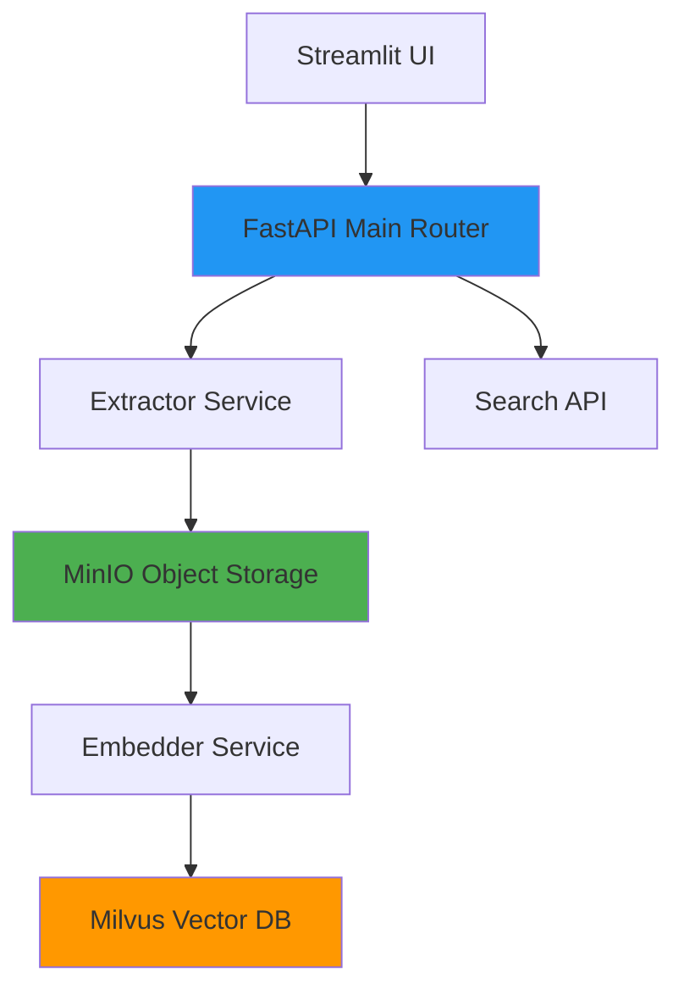

# Architecture Overview

deepSightAI Trinetra is a distributed system for semantic video search. This page provides a high-level view of the architecture and data flow.

For production deployments, see [Installation Guides](..//installation/kubernetes.md). For developers contributing code, see [Developer Guide](../development/contributing.md).

---

## System Diagram



---

## Data Flow

```
1. User uploads video (MP4)
   ↓
2. API validates, stores in MinIO "videos/" bucket
   ↓
3. API splits video into 30-second segments
   ↓
4. API asks Registry for available Extractor
   ↓
5. Extractor downloads segment, extracts 1 FPS frames as JPEG
   ↓
6. Extractor uploads frames to MinIO "frames/" bucket
   ↓
7. Extractor marks segment as complete
   ↓
8. Embedder polls MinIO, finds new frames
   ↓
9. Embedder downloads frames in batches (32)
   ↓
10. Embedder generates CLIP embeddings (512-dim vectors)
   ↓
11. Embedder inserts vectors into Milvus HNSW index
   ↓
12. Embedder deletes frames from MinIO (cleanup)
   ↓
13. Video status = "ready" (searchable)
   ↓
14. User searches: "red truck"
   ↓
15. API encodes query to vector using CLIP
   ↓
16. Milvus performs approximate nearest neighbor search
   ↓
17. Results returned with timestamps, thumbnails
```

---

## Core Components

### Main API Router

- **Technology**: FastAPI (Python 3.11)
- **Responsibilities**: Video ingestion, segmentation, RTSP coordination, service discovery
- **Ports**: 8080 (HTTP), 8443 (HTTPS)

[Detailed component docs](components.md)

---

### Extractor Workers

- **Technology**: FastAPI + GStreamer
- **Responsibilities**: Frame extraction (1 FPS), JPEG encoding
- **Scalability**: Horizontal (can run 1-50 pods)
- **Ports**: 8001-8099 (internal)

---

### Embedder Service

- **Technology**: Python, PyTorch/ONNX Runtime
- **Model**: OpenCLIP ViT-B-32 (512-dimensional embeddings)
- **Responsibilities**: Vector generation, Milvus insertion
- **GPU**: Optional (recommended for production)

---

### Vector Database

- **Technology**: Milvus 2.x
- **Index**: HNSW (Hierarchical Navigable Small World)
- **Dimensions**: 512
- **Distance metric**: Cosine similarity
- **Collections**: `video_frames` (partitioned by tenant)

---

### Object Storage

- **Technology**: MinIO (S3-compatible)
- **Buckets**:
  - `videos` - original uploads
  - `frames` - extracted JPEGs (temporary)
  - `frames-rtsp` - live stream frames

---

## Deployment Topologies

### Single Host (Docker Compose)

All services on one machine. For evaluation and small deployments (<10 videos/day). See [Installation → Docker Compose](installation/docker-compose.md).

---

### Kubernetes Cluster (Production)

Horizontally scalable, HA, multi-tenant. Components deployed as:
- **Deployments** (stateless services: API, Extractor, Embedder)
- **StatefulSets** (stateful: PostgreSQL, Redis, MinIO, Milvus)
- **HPA** (autoscaling extractors based on queue depth)

See [Installation → Kubernetes](installation/kubernetes.md).

---

## Security Model

### Multi-Tenancy

Every piece of data tagged with `tenant_id`:
- PostgreSQL: schema per tenant OR row-level security
- MinIO: `{tenant_id}/frames/...`
- Milvus: partition key = tenant_id

[Full security details](security.md)

---

### Authentication

JWT-based (RS256). Issued by AuthService (Keycloak/Okta compatible). All API calls require valid token.

---

### Audit Logging

All actions logged to `audit_logs` table with WORM (immutable) storage. Also streamed to Kafka and SIEM (Splunk/Elastic).

[Audit architecture](../audit/overview.md)

---

## Observability

### Metrics

Prometheus endpoints on all services:
- API request latency
- Extractor queue depth
- Embedder FPS
- Milvus memory usage
- MinIO operation counts

### Logging

Structured JSON logs via stdout. Collected by Fluentd/Logstash → Elasticsearch/Loki.

### Tracing

OpenTelemetry distributed tracing (optional, Jaeger).

[Monitoring guide](../operations/monitoring.md)

---

## Performance Characteristics

| Metric | Value | Notes |
|--------|-------|-------|
| Frame extraction rate | 1 FPS | Adjustable per camera |
| Embedding throughput | 32 FPS/batch (GPU) / 5 FPS (CPU) | Batch size 32 |
| Search latency | 50-200ms | @ 100K frames, HNSW |
| Video processing time | ~1x realtime | For 1 GPU + 2 extractors |
| Max concurrent uploads | 10/tenant | Configurable |

---

## Scalability Limits

| Scale | Configuration | Approx Cost (AWS) |
|-------|---------------|-------------------|
| <10 videos/day | Docker Compose, 1 node | $0 (existing hardware) |
| 100 videos/day | k3s, 3 nodes (m5.large) | $300/mo |
| 1,000 videos/day | EKS, 5 nodes (m5.xlarge) + 2 GPU (g4dn.xlarge) | $2,000/mo |
| 10,000+ videos/day | EKS, 20+ nodes, Milvus cluster | $15,000/mo |

---

## Technology Stack

| Layer | Technology | License |
|-------|------------|---------|
| API | FastAPI, Uvicorn | MIT |
| Stream Processing | GStreamer | LGPL |
| Vector DB | Milvus | Apache 2.0 |
| Object Storage | MinIO | AGPL |
| Cache/Registry | Redis | BSD |
| Database | PostgreSQL | PostgreSQL |
| Message Queue | Kafka | Apache 2.0 |
| Orchestration | Kubernetes | Apache 2.0 |
| Packaging | Helm, Kustomize | Apache 2.0 |
| CI/CD | ArgoCD, GitHub Actions | Apache 2.0, MIT |

---

## Further Reading

- [Component deep dive](components.md)
- [Security architecture](security.md)
- [Diagrams & data flow](diagrams.md)
- [Operations guide](../operations/monitoring.md)
- [Kubernetes deployment](..//installation/kubernetes.md)

---

**Questions?** Check [FAQ](../operations/faq.md) or [GitHub Discussions](https://github.com/yourorg/deepSightAI-Trinetra/discussions).
