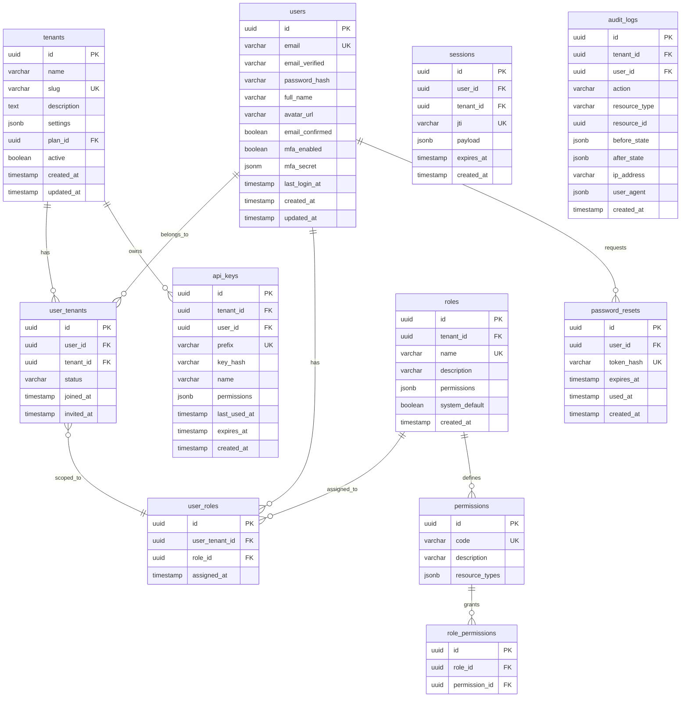

# Authentication & Authorization Schema Design

**Task**: T1.2.1
**Status**: Draft
**Last Updated**: 2026-04-02

## Overview

This document defines the database schema for multi-tenant authentication and authorization in ClipSight. The schema supports:

- Multi-tenancy with tenant isolation
- Role-based access control (RBAC)
- User management with email/password
- API key authentication for programmatic access
- OAuth2 social login (optional extension)
- Secure password reset flow
- Session management with JWT

---

## Entity Relationship Diagram (ERD)



---

## Table Definitions

### 1. `tenants`

**Purpose**: Organization container for multi-tenancy. All data is scoped to a tenant.

| Column | Type | Constraints | Description |
|--------|------|-------------|-------------|
| `id` | UUID | PK, default gen_random_uuid() | Unique tenant identifier |
| `name` | VARCHAR(255) | NOT NULL | Display name |
| `slug` | VARCHAR(100) | NOT NULL, UNIQUE | URL-safe unique identifier |
| `description` | TEXT | NULLABLE | Optional description |
| `settings` | JSONB | DEFAULT `{}` | Tenant-specific config (features, limits, branding) |
| `plan_id` | UUID | FK → `billing_plans.id` | Billing/subscription plan |
| `active` | BOOLEAN | DEFAULT true | Soft delete/disable flag |
| `created_at` | TIMESTAMPTZ | DEFAULT now() | Creation timestamp |
| `updated_at` | TIMESTAMPTZ | DEFAULT now() | Last modification |

**Indexes**:
- `idx_tenants_slug` (slug)
- `idx_tenants_active` (active)

---

### 2. `users`

**Purpose**: Global user accounts. One user can belong to multiple tenants (SaaS model).

| Column | Type | Constraints | Description |
|--------|------|-------------|-------------|
| `id` | UUID | PK, default gen_random_uuid() | Unique user identifier |
| `email` | VARCHAR(255) | NOT NULL, UNIQUE, LOWER | Primary identifier (lowercased) |
| `email_verified` | BOOLEAN | DEFAULT false | Email verification status |
| `password_hash` | VARCHAR(255) | NULLABLE | Argon2id hash (null if OAuth-only) |
| `full_name` | VARCHAR(255) | NOT NULL | User's display name |
| `avatar_url` | VARCHAR(500) | NULLABLE | Profile picture URL |
| `mfa_enabled` | BOOLEAN | DEFAULT false | MFA status |
| `mfa_secret` | JSON | NULLABLE | Encrypted TOTP secret |
| `last_login_at` | TIMESTAMPTZ | NULLABLE | Last successful login |
| `created_at` | TIMESTAMPTZ | DEFAULT now() | Account creation |
| `updated_at` | TIMESTAMPTZ | DEFAULT now() | Last profile update |

**Indexes**:
- `idx_users_email` (email)
- `idx_users_last_login` (last_login_at)

**Notes**:
- Users authenticate with email+password or OAuth2
- Password hash uses Argon2id (memory-hard, adaptive)
- OAuth-only users have `password_hash = NULL` and `email_verified = true`

---

### 3. `user_tenants`

**Purpose**: Junction table linking users to tenants. Defines which tenant(s) a user belongs to.

| Column | Type | Constraints | Description |
|--------|------|-------------|-------------|
| `id` | UUID | PK, default gen_random_uuid() | Unique membership ID |
| `user_id` | UUID | NOT NULL, FK → `users.id` ON DELETE CASCADE | User reference |
| `tenant_id` | UUID | NOT NULL, FK → `tenants.id` ON DELETE CASCADE | Tenant reference |
| `status` | VARCHAR(20) | DEFAULT 'active', CHECK: 'active'/'invited'/'suspended' | Membership status |
| `joined_at` | TIMESTAMPTZ | DEFAULT now() | When user joined tenant |
| `invited_at` | TIMESTAMPTZ | NULLABLE | Invitation timestamp (if status='invited') |
| `UNIQUE` | (user_id, tenant_id) | -- | Prevent duplicate memberships |

**Indexes**:
- `idx_user_tenants_user` (user_id)
- `idx_user_tenants_tenant` (tenant_id)
- `idx_user_tenants_status` (status)

**Notes**:
- ON DELETE CASCADE ensures cleanup when user/tenant removed
- A user can have different roles in different tenants (via `user_roles` table)

---

### 4. `roles`

**Purpose**: Defines permission sets within a tenant. Tenant-specific but can be based on system templates.

| Column | Type | Constraints | Description |
|--------|------|-------------|-------------|
| `id` | UUID | PK, default gen_random_uuid() | Unique role ID |
| `tenant_id` | UUID | NOT NULL, FK → `tenants.id` ON DELETE CASCADE | Tenant scope |
| `name` | VARCHAR(50) | NOT NULL | Role name (e.g., 'admin', 'viewer') |
| `description` | VARCHAR(255) | NULLABLE | Human-readable description |
| `permissions` | JSONB | DEFAULT `[]` | Array of permission codes (cached for performance) |
| `system_default` | BOOLEAN | DEFAULT false | Built-in role (cannot delete) |
| `created_at` | TIMESTAMPTZ | DEFAULT now() | Creation timestamp |

**Indexes**:
- `idx_roles_tenant` (tenant_id)
- `UNIQUE` (tenant_id, name)

**Built-in Roles** (system_default=true):
- `admin`: Full tenant access (all permissions)
- `editor`: Read/Write but no admin operations
- `viewer`: Read-only access

**Custom roles**: Tenant admins can create additional roles with granular permissions.

---

### 5. `user_roles`

**Purpose**: Assigns roles to users within a tenant. Many-to-many between `user_tenants` and `roles`.

| Column | Type | Constraints | Description |
|--------|------|-------------|-------------|
| `id` | UUID | PK, default gen_random_uuid() | Unique assignment ID |
| `user_tenant_id` | UUID | NOT NULL, FK → `user_tenants.id` ON DELETE CASCADE | Membership reference |
| `role_id` | UUID | NOT NULL, FK → `roles.id` ON DELETE CASCADE | Role reference |
| `assigned_at` | TIMESTAMPTZ | DEFAULT now() | Assignment timestamp |
| `UNIQUE` | (user_tenant_id, role_id) | -- | Prevent duplicate assignments |

**Indexes**:
- `idx_user_roles_user_tenant` (user_tenant_id)
- `idx_user_roles_role` (role_id)

**Notes**:
- Directly referenced by permission middleware to determine access
- A user can have multiple roles in a tenant (e.g., both 'editor' and custom role)

---

### 6. `api_keys`

**Purpose**: Programmatic authentication tokens for service-to-service or script access.

| Column | Type | Constraints | Description |
|--------|------|-------------|-------------|
| `id` | UUID | PK, default gen_random_uuid() | Unique API key ID |
| `tenant_id` | UUID | NOT NULL, FK → `tenants.id` ON DELETE CASCADE | Tenant owner |
| `user_id` | UUID | NOT NULL, FK → `users.id` ON DELETE CASCADE | User who created key |
| `prefix` | VARCHAR(12) | NOT NULL, UNIQUE | Public prefix (e.g., 'clp_live_xxx') |
| `key_hash` | VARCHAR(255) | NOT NULL | Argon2id hash of full key (prefix+suffix stored separately) |
| `name` | VARCHAR(100) | NOT NULL | Descriptive label (e.g., 'CI/CD pipeline') |
| `permissions` | JSONB | DEFAULT `[]` | Array of permission codes (can be subset of user's roles) |
| `last_used_at` | TIMESTAMPTZ | NULLABLE | Last successful API call |
| `expires_at` | TIMESTAMPTZ | NULLABLE | Expiration (null = never expires) |
| `created_at` | TIMESTAMPTZ | DEFAULT now() | Key creation |

**Indexes**:
- `idx_api_keys_tenant` (tenant_id)
- `idx_api_keys_prefix` (prefix)
- `idx_api_keys_user` (user_id)

**Security**:
- Full API key never stored in DB (only hash)
- Prefix (12 chars) stored for identification/lookup
- Client sends: `Authorization: Bearer <full_key>`
- Server: extract prefix, lookup key row by prefix, verify hash with suffix
- Rotate by creating new key, updating client, then deleting old key

---

### 7. `password_resets`

**Purpose**: Secure password reset tokens with expiration.

| Column | Type | Constraints | Description |
|--------|------|-------------|-------------|
| `id` | UUID | PK, default gen_random_uuid() | Unique request ID |
| `user_id` | UUID | NOT NULL, FK → `users.id` ON DELETE CASCADE | User requesting reset |
| `token_hash` | VARCHAR(255) | NOT NULL, UNIQUE | Hash of reset token (never store plaintext) |
| `expires_at` | TIMESTAMPTZ | NOT NULL | Expiration (typically +1 hour) |
| `used_at` | TIMESTAMPTZ | NULLABLE | Reset completion timestamp |
| `created_at` | TIMESTAMPTZ | DEFAULT now() | Request creation |

**Indexes**:
- `idx_password_resets_user` (user_id)
- `idx_password_resets_expires` (expires_at) (for cleanup job)

**Flow**:
1. User requests reset → send email with token (signed, expires in 1h)
2. Token validated → user can set new password
3. Set `used_at` on success to prevent reuse
4. Periodic cleanup job deletes expired/used records (> 24h)

---

### 8. `sessions` (optional - for server-side session revocation)

**Purpose**: Track active JWT sessions for logout/revocation. Not strictly required if using stateless JWTs without revocation.

| Column | Type | Constraints | Description |
|--------|------|-------------|-------------|
| `id` | UUID | PK, default gen_random_uuid() | Session record ID |
| `user_id` | UUID | NOT NULL, FK → `users.id` ON DELETE CASCADE | User |
| `tenant_id` | UUID | NOT NULL, FK → `tenants.id` ON DELETE CASCADE | Current tenant context |
| `jti` | VARCHAR(36) | NOT NULL, UNIQUE | JWT ID claim (for revocation) |
| `payload` | JSONB | NOT NULL | Full JWT claims (user_id, tenant_id, roles, exp, iat) |
| `expires_at` | TIMESTAMPTZ | NOT NULL | JWT expiration |
| `created_at` | TIMESTAMPTZ | DEFAULT now() | When session started |

**Indexes**:
- `idx_sessions_user` (user_id)
- `idx_sessions_jti` (jti) (for lookups)
- `idx_sessions_expires` (expires_at) (for cleanup)

**Notes**:
- Optional: Store sessions for ability to revoke specific JWTs before expiry
- On logout: delete session row by jti → token invalidated
- If stateless (no revocation), this table can be omitted

---

## Permissions System

### Permission Codes

Permissions follow the pattern: `resource:action:scope`

Examples:
- `videos:read:self` - Read own videos
- `videos:read:tenant` - Read all tenant videos
- `videos:create:*` - Create videos in any tenant
- `users:manage:tenant` - Manage tenant users
- `settings:read:*` - Read tenant settings

**Standard Permission Resources**:
- `videos` - Video processing operations
- `users` - User management
- `tenants` - Tenant settings
- `api_keys` - API key management
- `audit_logs` - Audit log viewing
- `settings` - Tenant configuration
- `billing` - Billing/subscription (admin only)

**Permission Storage**:
- In `roles.permissions` as JSON array: `["videos:read:tenant", "users:read:self"]`
- In `api_keys.permissions` for scoped API access
- Checked by middleware: `if required_permission in user.permissions: allow`

---

## Migration Order

```sql
-- 1. Core multi-tenancy
CREATE TABLE tenants (...);
CREATE TABLE users (...);

-- 2. Membership & roles
CREATE TABLE user_tenants (...);
CREATE TABLE roles (...);
CREATE TABLE user_roles (...);

-- 3. Authentication
CREATE TABLE api_keys (...);
CREATE TABLE password_resets (...);
CREATE TABLE sessions (...);  -- optional

-- 4. Authorization (if using separate permission model)
CREATE TABLE permissions (...);
CREATE TABLE role_permissions (...);

-- 5. Audit trail
CREATE TABLE audit_logs (...);
```

---

## Row-Level Security (RLS) Considerations

For **extreme security**, enable PostgreSQL Row Level Security on all data tables (not just auth tables):

```sql
ALTER TABLE videos ENABLE ROW LEVEL SECURITY;
CREATE POLICY tenant_isolation ON videos
    USING (tenant_id = current_setting('app.current_tenant_id')::uuid);
```

Where application sets `app.current_tenant_id` from JWT claims per request. This guarantees **zero chance** of cross-tenant data leaks even if application logic fails.

---

## Security Best Practices

1. **Password Storage**: Argon2id (memory-hard, adaptive). Never bcrypt or plain SHA256.
2. **API Key Storage**: Store only hash, never plaintext key.
3. **Token Expiration**: JWTs expire in 1-24h, refresh tokens separate (if using refresh flow).
4. **Rate Limiting**: Per-user and per-tenant rate limits on auth endpoints.
5. **Audit Logging**: All auth events (login, role change, password reset) logged to `audit_logs`.
6. **Email Verification**: Require verification before full access (except OAuth where provider verifies email).
7. **MFA**: Optional TOTP-based MFA for sensitive operations.
8. **Password Reset Tokens**: Single-use, expire in 1 hour.

---

## Acceptance Criteria Checklist

- [x] **users** table defined with email, password_hash, MFA fields
- [x] **roles** table defined with tenant-scoped permissions
- [x] **tenants** table defined for multi-tenancy
- [x] **api_keys** table defined with secure hash storage
- [x] **user_tenants** junction table for many-to-many user↔tenant
- [x] **user_roles** junction table for many-to-many user↔role
- [x] **password_resets** table for secure reset flow
- [x] ERD diagram included (above)
- [x] Relationships documented with foreign keys
- [x] Index strategy defined
- [x] Security considerations documented
- [x] Migration order specified

---

## Next Steps

1. Review and approve this design
2. Generate SQL migration files (e.g., using Alembic)
3. Implement repository classes for each table
4. Build AuthService with registration, login, JWT issuance
5. Implement middleware for JWT validation and RBAC (T1.2.4, T1.2.5, T1.2.6)

---

**Status**: Ready for implementation pending approval.
