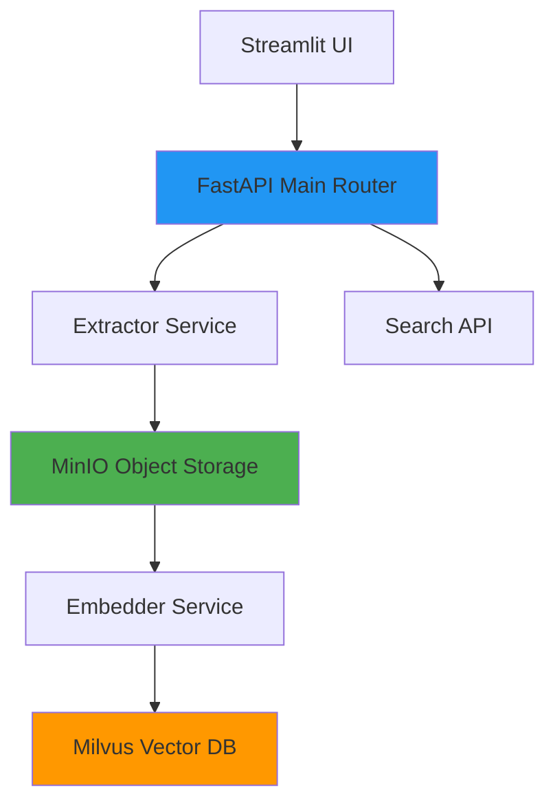

# deepSightAI Trinetra Enterprise

<div class="grid cards" markdown>

- :material-play-circle: __Quickstart__

  ---

  Get up and running in 5 minutes with Docker Compose

  [:octicons-arrow-right-24: Quickstart Guide](quickstart.md)

- :material-download: __Installation__

  ---

  Deploy on Docker, Kubernetes (k3s/EKS/GKE), or any cloud

  [:octicons-arrow-right-24: Installation Options](installation/docker-compose.md)

- :material-book-open-page-variant: __User Guide__

  ---

  Upload videos, search content, integrate via API

  [:octicons-arrow-right-24: Learn More](user-guide/index.md)

- :material-api: __API Reference__

  ---

  Complete REST API documentation with examples

  [:octicons-arrow-right-24: API Docs](user-guide/api.md)

- :material-security: __Security & Compliance__

  ---

  Multi-tenancy, encryption, audit logging, immutable storage

  [:octicons-arrow-right-24: Security Overview](architecture/security.md)

- :material-deployment: __Operations__

  ---

  Monitoring, backup, troubleshooting, scaling

  [:octicons-arrow-right-24: Operations Guide](operations/monitoring.md)

</div>

---

## What is deepSightAI Trinetra?

**deepSightAI Trinetra** is an enterprise-grade video content search platform that lets you find specific moments in hours of video footage using natural language queries. Simply upload a video, and deepSightAI Trinetra automatically:

1. **Extracts frames** (1 per second) using GStreamer
2. **Generates AI embeddings** with OpenCLIP (vision-language model)
3. **Enables semantic search** - search for "red truck" or "person wearing helmet" without manual tagging

### Who Uses deepSightAI Trinetra?

- 🚓 **Law Enforcement**: Find suspects, vehicles, weapons in bodycam/security footage
- 🏬 **Retail & Commercial**: Analyze customer behavior, queue lengths, demographics
- 🏭 **Logistics & Manufacturing**: Verify PPE compliance, detect safety violations
- 🏥 **Healthcare**: Monitor patient activity, equipment usage (HIPAA-compliant deployment)
- 🔒 **Government & Critical Infrastructure**: On-premise deployment with full data sovereignty

---

## Key Features

<div class="grid cards" markdown>

- :material-lock: **Multi-Tenant by Design**
  { .my-2 }

  Complete data isolation between tenants using PostgreSQL schemas, MinIO prefixes, and Milvus partitions. No cross-tenant data leakage.

- :material-shield-check: **Immutable Audit Logs**
  { .my-2 }

  All user actions logged to WORM (Write Once Read Many) storage with 7+ year retention. Compliant with GDPR, CJIS, FOID requirements.

- :material-cloud: **Vendor-Neutral Deployment**
  { .my-2 }

  Runs on any infrastructure: single Docker host, k3s edge clusters, or managed Kubernetes (EKS/GKE/AKS). No cloud lock-in.

- :material-kubernetes: **Kubernetes-Native**
  { .my-2 }

  Built for K8s from the start. Horizontal scaling of extractors and embedders. GitOps deployment with ArgoCD.

- :material-extension: **Plugin Architecture**
  { .my-2 }

  Extensible detection plugins: License Plate Recognition, Weapon Detection, Face Blur, PPE detection, Demographics, Heatmaps.

- :material-connection: **Enterprise Integration**
  { .my-2 }

  mTLS between services, OIDC authentication (Keycloak/ Okta), SIEM integration (Splunk/Elastic), Kafka event streams.

</div>

---

## Quick Demo

```bash
# 1. Clone and start
git clone https://github.com/yourorg/deepSightAI-Trinetra.git
cd deepSightAI-Trinetra
docker-compose -f "Server and Extractor/docker-compose.extractor.yml" up -d
docker-compose -f "Embedder/docker-compose.embedder.yaml" up -d

# 2. Upload a video via API or UI
curl -X POST http://localhost:8080/process_video \
  -F "file=@/path/to/video.mp4"

# 3. Wait for processing (automatic)

# 4. Search!
curl -X POST http://localhost:8080/search \
  -H "Authorization: Bearer <YOUR_JWT>" \
  -d '{"query": "red truck", "top_k": 10}'
```

See [Quickstart](quickstart.md) for complete walkthrough with UI screenshots.

---

## Architecture Highlights



- **Scale-out processing**: Add more extractor workers to handle concurrent videos
- **Resilient storage**: MinIO with replication, Milvus with HNSW indexing
- **Event-driven**: Redis Streams for coordination between components
- **Observable**: Prometheus metrics, structured logs, distributed tracing

See [Architecture Overview](architecture/index.md) for details.

---

## Deployment Options

| Option | Scale | Use Case | Complexity |
|--------|-------|----------|------------|
| Docker Compose | 1 host, <10 videos/day | Evaluation, small teams | Low |
| k3s (single-node) | 5-10 videos/day | Medium business, edge | Medium |
| k3s cluster | 100-1000 videos/day | Multi-site enterprise | Medium |
| Managed K8s (EKS/GKE) | 1000+ videos/day | Large-scale, global | High |

All options use the **same container images and Helm charts** - just change the cluster size.

See [Installation Guide](installation/docker-compose.md) to get started.

---

## Security First

- **Encryption everywhere**: TLS 1.3 in transit, AES-256 at rest (MinIO SSE, PostgreSQL TDE)
- **Zero-trust networking**: Network Policies, mTLS between services, Istio service mesh optional
- **Audit trail**: All actions logged to immutable PostgreSQL table with Kafka streaming to SIEM
- **Secrets management**: HashiCorp Vault with automatic rotation
- **Compliance**: GDPR (data deletion), CJIS (audit), HIPAA (encryption), SOC2 (monitoring)

Read the [Security Architecture](architecture/security.md) for complete details.

---

## Open Source & Vendor-Neutral

deepSightAI Trinetra is **100% open-source** (AGPL v3). We use only CNCF projects and open standards:

- **Kubernetes** for orchestration
- **Helm** for packaging
- **ArgoCD** for GitOps
- **PostgreSQL** for metadata
- **MinIO** for object storage
- **Milvus** for vector search
- **Redis** for service registry
- **Kafka** for event streaming
- **Prometheus** for monitoring

No proprietary cloud services required. Deploy anywhere.

---

## Get Started Now

<div class="grid cards" markdown>

- :octicons-rocket-16: **New?** Start with [Quickstart](quickstart.md) (5 minutes)

- :octicons-document-16: **Deploying?** Read [Installation](installation/docker-compose.md)

- :octicons-beaker-16: **Developer?** See [Contributing Guide](about/contributing.md)

- :octicons-people-16: **Need Help?** Check [FAQ](operations/faq.md) or [GitHub Issues](https://github.com/yourorg/deepSightAI-Trinetra/issues)

</div>

---

## Community & Support

- **GitHub**: [github.com/yourorg/deepSightAI-Trinetra](https://github.com/yourorg/deepSightAI-Trinetra)
- **Discussions**: [GitHub Discussions](https://github.com/yourorg/deepSightAI-Trinetra/discussions)
- **Slack**: [deepSightAI-Trinetra-community.slack.com](https://deepSightAI-Trinetra-community.slack.com) (invite via website)
- **Docs**: This site is built with [MkDocs Material](https://squidfunk.github.io/mkdocs-material/)

---

**Ready to deploy?** Head to the [Installation Guide](installation/docker-compose.md) → [:octicons-arrow-right-24:](installation/docker-compose.md)
